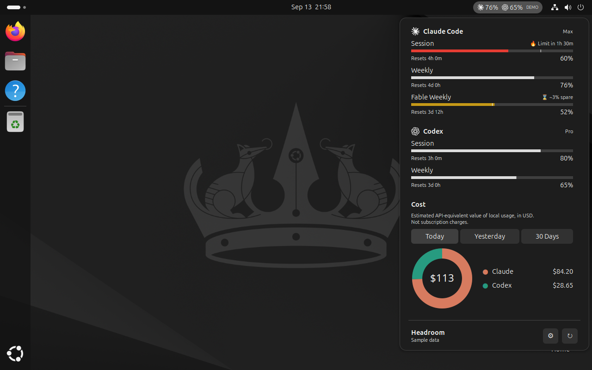
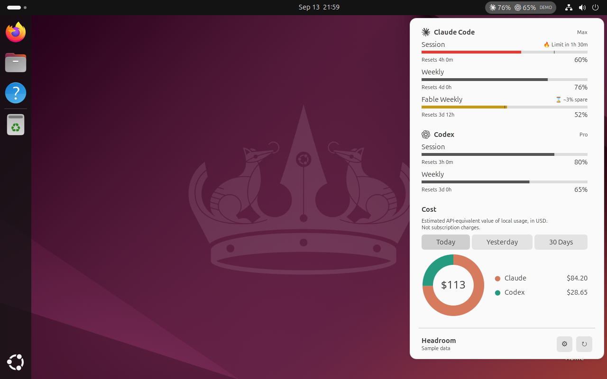
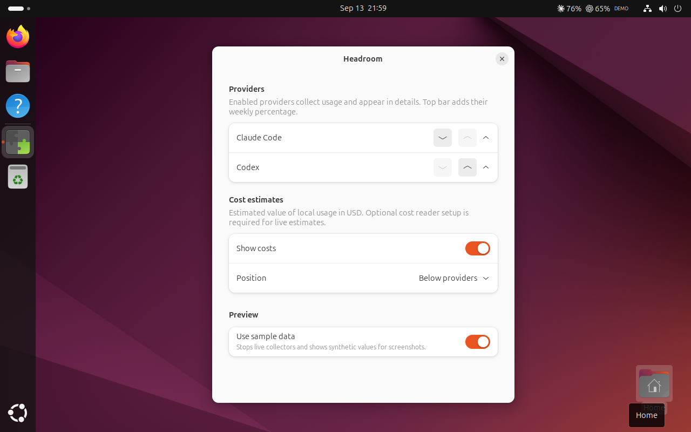

# Headroom for GNOME Shell

Claude Code and Codex quotas in your Ubuntu top bar, with reset countdowns,
forecasts, and optional local cost estimates. Built for **Ubuntu 24.04 / GNOME 46**.
Other GNOME versions are not supported by this release.




## Install

Using an agent? Give it this repository link and ask:

> Install Headroom for my Ubuntu desktop, including local cost estimates.

Or do it yourself:

1. Download **install.py** from the [latest release](https://github.com/steveclarke/gnome-headroom/releases/latest).
2. Open a terminal and run:

   ```sh
   python3 ~/Downloads/install.py --costs
   ```

3. Log out of Ubuntu and log back in. Headroom appears in the top bar.

The installer checks GNOME compatibility, downloads and verifies the extension,
and enables it for your next login. `--costs` also sets up the optional cost reader;
it may ask for your password to install the Settings app or Node.js through Ubuntu. Omit `--costs`
if you only want quotas. Run it as your normal desktop user, without sudo.

Prefer to install the ZIP yourself? See [manual installation](#manual-installation).

## Your existing accounts

**Just make sure you're already logged in to Claude Code and/or Codex on this
computer.** Headroom uses those existing logins. You do not need to sign in again
or connect your accounts to Headroom.

Headroom cannot retrieve quota information from a provider unless you are logged
in to it. If a provider is unavailable, open its CLI and check that it works, then
refresh Headroom. Turn off any provider you do not use in Settings.

## Use

- Click the bar to see quota windows, reset countdowns, and forecasts.
- Click the gear for provider enablement, top-bar visibility, order, and costs.
  Under **Top bar**, choose which quota windows sit next to each icon: the weekly
  window (default), the 5-hour session window, or both, shown as `5h 74% · 7d 61%`.
- Click Refresh, or right-click the bar, to request an update. Automatic updates
  run every five minutes; repeated manual requests are limited to one per 20 seconds.
- A dash means unavailable; `!` marks stale data. Forecasts need a known window
  duration and enough elapsed time. They are estimates, not guarantees.
- **Use sample data** in Settings is for previews only. It stops live collection
  and adds a DEMO label. It is off by default. All screenshots here use sample data.



## Optional cost estimates

Costs estimate the API-equivalent USD value of your local CLI history. They are
not subscription charges and do not include history on other computers.
Quota readings work without this setup; turn off Show costs if you do not need it.

If you installed with `--costs`, this is already set up. To add it later, run the
same installer with `--costs`. It uses a temporary, checksum-verified Bun download
to install the locked cost reader. You do not need to install Bun yourself or find
the extension's folder. Existing CLI logins and history stay in place.

## Update or remove

To update, run the installer again, then log out and back in. Settings and CLI sign-ins remain separate from the extension.

To remove:

```sh
gnome-extensions disable headroom@steveclarke.github.io
gnome-extensions uninstall headroom@steveclarke.github.io
```

This leaves your CLI accounts and history alone. The optional reader is stored
under `~/.local/share/headroom/` (or your XDG data directory).

## Manual installation

Download the extension ZIP from the latest release, then run:

```sh
gnome-extensions install --force ~/Downloads/headroom@steveclarke.github.io.zip
```

Log out and back in, then enable it:

```sh
gnome-extensions enable headroom@steveclarke.github.io
gnome-extensions info headroom@steveclarke.github.io
```

The status should say `ACTIVE`. On Ubuntu, install `gnome-shell-extension-prefs`
if the Settings window is unavailable. Manual cost setup is still available as
`bin/setup-costs` in the installed extension; it requires Node.js and Bun.

## Troubleshooting

- **No icon:** confirm GNOME 46 and `State: ACTIVE` using the command above. If
  extensions are globally disabled, turn them on in the Extensions application.
- **Unavailable or stale:** run the relevant CLI, sign in again if needed, and
  refresh. Claude's CLI refreshes its own expired credentials.
- **Codex not found:** a shell version manager may expose Codex only in interactive
  terminals. The collector searches standard user/system install paths and known
  mise locations. For a custom install, link its stable executable into
  `~/.local/bin/codex`, then log out and back in.
- **Cost reader missing:** complete the optional setup above, or turn off costs.
- **After an update:** log out and back in; toggling the extension does not reload
  its JavaScript modules on Wayland.

See [development and release instructions](gnome/README.md) and
[privacy/security notes](SECURITY.md). Please redact account details and usage
before opening an issue.

## Credits

An independent port of [Omarchy Headroom](https://github.com/steveclarke/omarchy-headroom).
Shared quota logic and MIT-licensed collectors are included with attribution in
[NOTICE](NOTICE). Provider names and icons belong to their respective owners.
This project is not affiliated with Anthropic or OpenAI. See [LICENSE](LICENSE).
